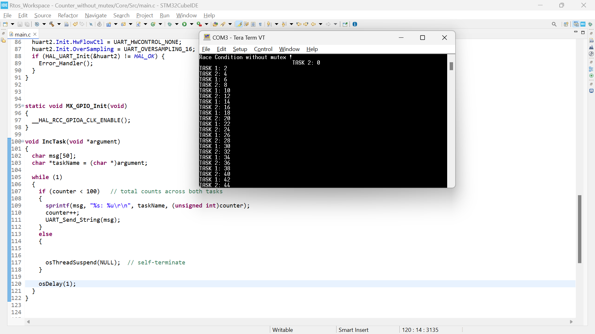

# Counter Without Mutex – FreeRTOS Example (STM32)

This project demonstrates a **race condition** problem in FreeRTOS when two tasks increment a shared counter **without synchronization**.

## 📝 Description
- Two tasks (`TASK 1` and `TASK 2`) increment a global counter.  
- Since no **mutex** is used, both tasks access the shared resource simultaneously.  
- This results in **inconsistent outputs** (values may overlap, skip, or appear out of order).  

## ⚡ Hardware & Tools
- STM32 Nucleo board (tested on STM32F4xx)  
- STM32CubeIDE with CMSIS-RTOS v2  
- UART (115200 baud) for logging  

## 🚀 Expected Behavior
- Counter values printed on UART will appear **non-sequential** and inconsistent due to race condition.  

## 📸 Output

## 📚 Key Learning
- Shared resources must be protected in multitasking systems.  
- Without synchronization, **race conditions** lead to unpredictable results.
